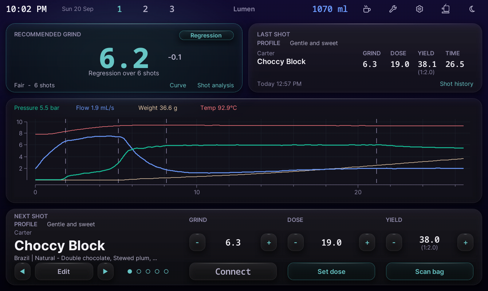
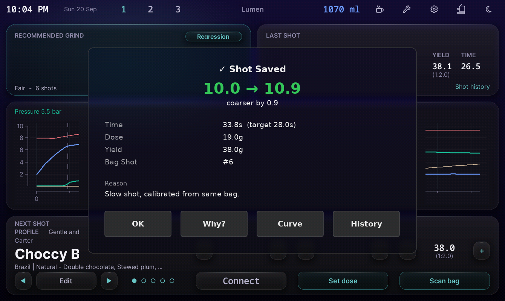
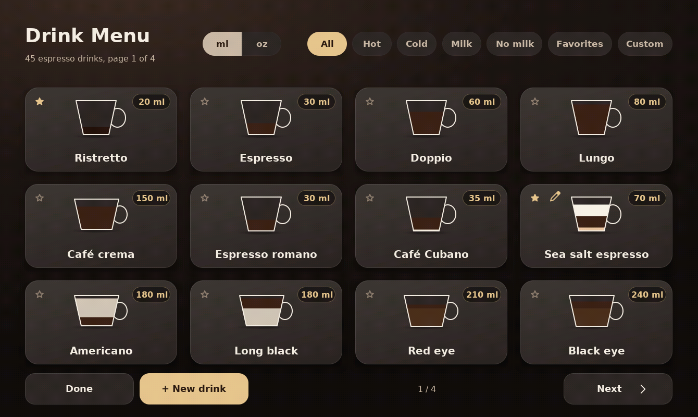
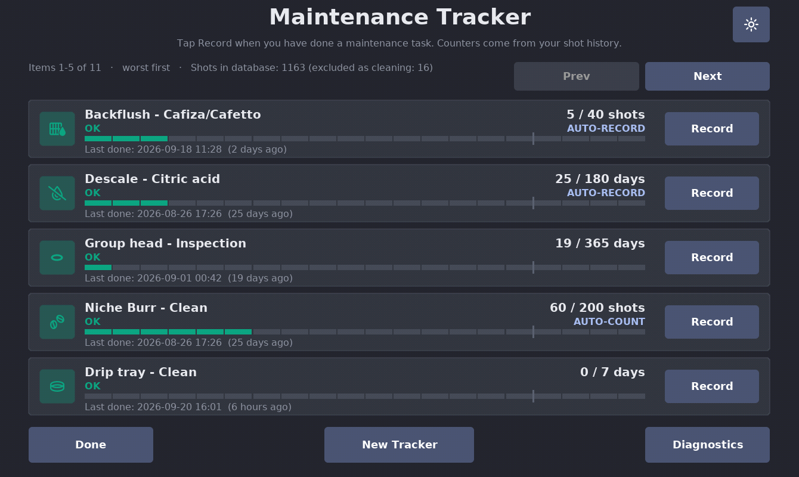
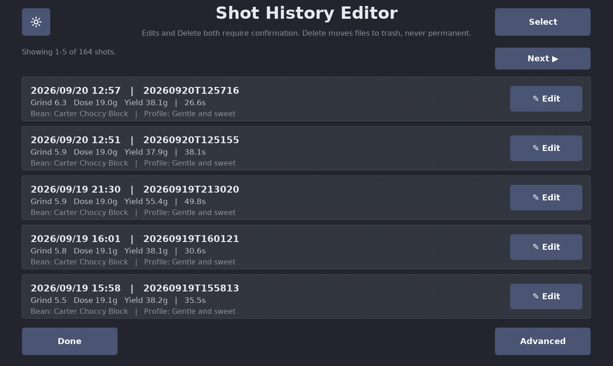
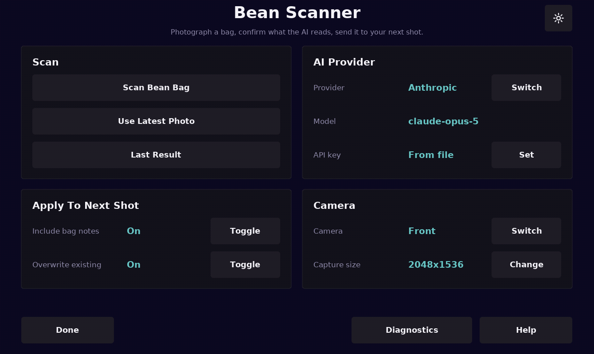

# DE1app toolkit by Blastize

**Five plugins and a skin for the classic Decent DE1 app, in one download. Drop two folders into the app, tick a few boxes, done.**

| Lumen skin 0.53.0 | Grind Advisor 3.16.3 |
|---|---|
|  |  |
| A glass dashboard home screen: next grind, last shot, live graph, next-shot beans, favorite profile slots, your own colours. | After every espresso: your next grind setting and why. Nothing to type. |

| Drink Menu 1.17.0 | Maintenance Tracker 0.22.0 |
|---|---|
|  |  |
| 45 drinks drawn as cups with their layers; favorites, custom drinks, one tap to load a linked profile. | Backflush, descale, gaskets, burrs, filter, bottle level, counted from your shots. Alerts can load the cleaning profile. |

| Shot History Editor 0.13.0 | Bean Scanner 0.9.13 |
|---|---|
|  |  |
| Your shots as cards. Fix a wrong grind or bean, delete mistakes to a restorable trash. The database is never written. | Photograph the bag; Claude or GPT reads the label into DYE's next shot. Needs your own API key. |

Each one has its own page with more screenshots, a changelog and the full reference:
[Lumen](https://github.com/Blastize/de1app-skin-Lumen) ·
[Grind Advisor](https://github.com/Blastize/de1app-plugin-GrindAdvisor) ·
[Drink Menu](https://github.com/Blastize/de1app-plugin-DrinkMenu) ·
[Maintenance Tracker](https://github.com/Blastize/de1app-plugin-MaintenanceTracker) ·
[Shot History Editor](https://github.com/Blastize/de1app-plugin-ShotHistoryEditor) ·
[Bean Scanner](https://github.com/Blastize/de1app-plugin-BeanScanner)

## Install (3 steps)

1. **Download.** Green **Code** button > **Download ZIP**, or grab the zip from [Releases](../../releases). Unzip it.
2. **Copy two folders.** Inside the unzipped folder are `plugins` and `skins`. Copy both into the app folder on the tablet, `de1plus`, merging with the folders already there (nothing of yours is replaced; each item lives in its own subfolder).
3. **Restart the app**, then tick the boxes below.

You can also take just the folders you want: every plugin is independent, and Lumen works without the plugins (it simply shows less).

## Turn things on

In the app: **Settings > App > Extensions**. Tick, in this order:

- [ ] **SDB** (comes with the app). The shot database that Grind Advisor, Maintenance Tracker and Shot History Editor read. The first time it is on it indexes your shot history, which can take a minute.
- [ ] **DYE** (comes with the app). Bean Scanner writes into it, and Lumen's next-shot strip shows it.
- [ ] **Grind Advisor**, **Drink Menu**, **Maintenance Tracker**, **Shot History Editor**, **Bean Scanner**. Each turns on the moment you tick it. A gear or settings button next to each one opens its page.

Then the skin: **Settings > App > Skin**, pick **Lumen** from the list, and restart the app once.

## First-time settings

- **Grind Advisor:** open its settings, set your **target shot time** and your grinder's **minimum and maximum**. It starts recommending after the first espresso of a bag and gets sharper with every shot.
- **Bean Scanner:** it needs an API key of your own (Anthropic or OpenAI, pay as you go; one scan costs a fraction of a cent). Either type it in its settings, or put a file named `api_key_anthropic.txt` or `api_key_openai.txt` containing the key into `de1plus/plugins/BeanScanner/`.
- **Maintenance Tracker:** tap **Record** on each tracker the next time you actually do that task; counters run from there. Backflush and descale record themselves after a real clean or descale cycle.
- **Lumen:** the moon/sun button switches dark and light; **Custom** in Lumen's settings opens the colour picker.
- **Drink Menu** and **Shot History Editor** need nothing.

## Safety, in one paragraph

Nothing here writes to your shot database. Grind Advisor, Maintenance Tracker and Lumen only read it. Shot History Editor edits one line of one shot file at a time, after a backup, and deletes into its own trash folder. Bean Scanner writes only into DYE's next shot, and only after you press Accept. Drink Menu, Maintenance Tracker and Lumen store their own preferences through the app's own settings calls. Nothing ever starts a flow on the machine by itself.

## Updating

Download the zip again and copy the two folders over the old ones. Your settings, trackers, custom drinks and themes live in files the zip does not contain, so they survive.

## Versions in this download

| Folder | Version |
|---|---|
| `skins/Lumen` | 0.53.0 |
| `plugins/GrindAdvisor` | 3.16.3 |
| `plugins/DrinkMenu` | 1.17.0 |
| `plugins/MaintenanceTracker` | 0.22.0 |
| `plugins/ShotHistoryEditor` | 0.13.0 |
| `plugins/BeanScanner` | 0.9.13 |

Built with Claude Code against the real app on a Galaxy Tab A9, verified on the machine before each release. GPL-3. Not affiliated with Decent Espresso. Bug reports and ideas: the issues page of the plugin concerned, or this repo.
